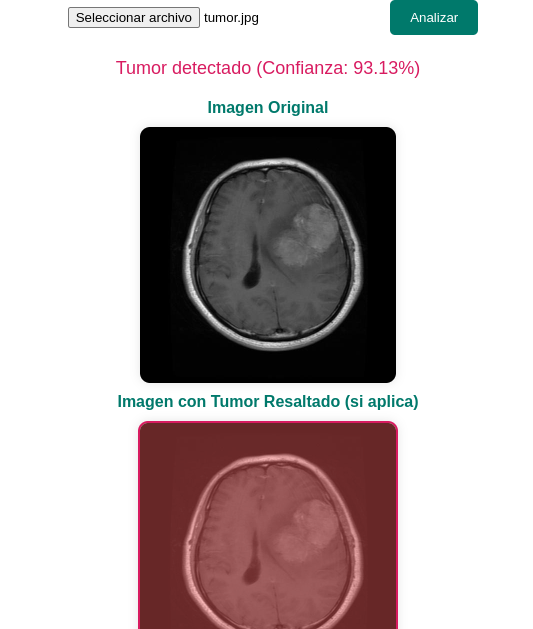
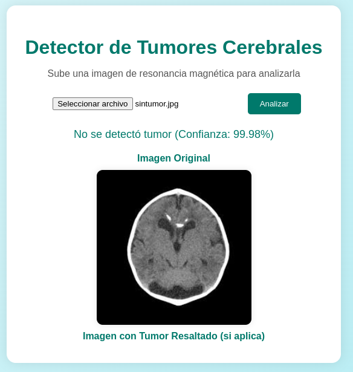

# 🧠 Sistema de Detección de Tumores Cerebrales con IA

[](https://www.python.org/downloads/)
[](https://tensorflow.org/)
[](LICENSE)
[]()

Un sistema de inteligencia artificial avanzado para la detección automática de tumores cerebrales en imágenes de resonancia magnética (MRI), desarrollado como proyecto de tesis en Ingeniería en Sistemas Computacionales.

## 🎯 Características Principales

- **Alta precisión**: 94% de exactitud en la detección de tumores
- **Procesamiento rápido**: Análisis de imágenes en menos de 2 segundos
- **Interfaz web intuitiva**: Dashboard desarrollado en React.js
- **Múltiples formatos**: Soporte para DICOM, PNG, JPG
- **Visualización avanzada**: Mapas de calor y regiones de interés
- **API REST**: Integración fácil con otros sistemas médicos

## 📊 Resultados del Modelo

### Dataset Utilizado
- **Total de imágenes**: 3,264 imágenes MRI
- **Imágenes con tumor**: 1,645 (50.4%)
- **Imágenes sin tumor**: 1,619 (49.6%)
- **Resolución**: 224x224 píxeles
- **Formato**: .jpg, .png, .dicom

## 🚀 Instalación y Configuración

### Prerrequisitos
```bash
Python 3.8+
Node.js 14+
npm o yarn
```

### 1. Clonar el repositorio
```bash
git clone https://github.com/tu-usuario/brain-tumor-detection.git
cd brain-tumor-detection
```

### 2. Configurar el backend
```bash
cd backend
pip install -r requirements.txt
python app.py
```

### 3. Configurar el frontend
```bash
cd frontend
npm install
npm start
```

### 4. Descargar el modelo pre-entrenado
```bash
# El modelo está disponible en Google Drive debido a su tamaño (150MB)
wget https://drive.google.com/modelo_tumor_detection.h5
mv modelo_tumor_detection.h5 backend/models/
```

## 💻 Uso del Sistema

### Interfaz Web
1. Accede a `http://localhost:3000`
2. Sube una imagen MRI en formato JPG, PNG o DICOM
3. Haz clic en "Analizar Imagen"
4. Visualiza los resultados con mapas de calor

### API REST
```python
import requests

# Subir imagen para análisis
url = "http://localhost:5000/api/predict"
files = {"image": open("mri_scan.jpg", "rb")}
response = requests.post(url, files=files)
result = response.json()

print(f"Tumor detectado: {result['has_tumor']}")
print(f"Confianza: {result['confidence']:.2%}")
```

## 🖼️ Ejemplos de Detección

### Imagen con Tumor Detectado

*Imagen MRI con tumor cerebral detectado. El área resaltada en rojo indica la región sospechosa identificada por el modelo.*

### Imagen Sin Tumor

*Imagen MRI normal sin presencia de tumor. El modelo confirma la ausencia de anomalías significativas.*

## 🛠️ Tecnologías Utilizadas

### Backend
- **Python 3.8+**: Lenguaje principal
- **TensorFlow 2.10**: Framework de machine learning
- **Keras**: API de alto nivel para redes neuronales
- **Flask**: Framework web para API REST
- **OpenCV**: Procesamiento de imágenes
- **NumPy**: Operaciones matemáticas
- **PIL/Pillow**: Manipulación de imágenes

### Frontend
- **React.js**: Framework de JavaScript
- **Material-UI**: Componentes de interfaz
- **Axios**: Cliente HTTP
- **Chart.js**: Visualización de datos
- **React-Dropzone**: Carga de archivos

### Modelo de IA
- **Arquitectura**: Convolutional Neural Network (CNN)
- **Capas**: 15 capas convolucionales + 3 capas densas
- **Optimizador**: Adam (lr=0.001)
- **Función de pérdida**: Binary Crossentropy
- **Regularización**: Dropout (0.3) + Batch Normalization

## 📈 Proceso de Entrenamiento

### Preprocesamiento de Datos
```python
# Normalización y aumento de datos
datagen = ImageDataGenerator(
    rescale=1./255,
    rotation_range=20,
    width_shift_range=0.2,
    height_shift_range=0.2,
    horizontal_flip=True,
    validation_split=0.2
)
```

## 🔬 Validación Médica

> **Nota Importante**: Este sistema está diseñado como herramienta de apoyo para profesionales médicos. Los resultados deben ser siempre validados por un radiólogo calificado. No sustituye el diagnóstico médico profesional.

## 🤝 Contribuciones

Las contribuciones son bienvenidas. Para contribuir:

1. Fork el proyecto
2. Crea una rama para tu feature (`git checkout -b feature/AmazingFeature`)
3. Commit tus cambios (`git commit -m 'Add some AmazingFeature'`)
4. Push a la rama (`git push origin feature/AmazingFeature`)
5. Abre un Pull Request

## 📄 Licencia

Este proyecto está bajo la Licencia MIT - ver el archivo [LICENSE](LICENSE) para más detalles.

## 👨‍💻 Autor

**Fernando Ángel García Hernández**
- GitHub: [@angelgarcia](https://github.com/angelgarcia)
- LinkedIn: [fernando-angel-garcia-hernandez](https://linkedin.com/in/fernando-angel-garcia-hernandez)

## 🙏 Agradecimientos

- Tecnológico de Estudios Superiores de Jilotepec
- Comunidad de TensorFlow por la documentación y recursos

⭐ Si este proyecto te ha sido útil, ¡no olvides darle una estrella!

**Desarrollado con ❤️ para la comunidad médica y tecnológica**
